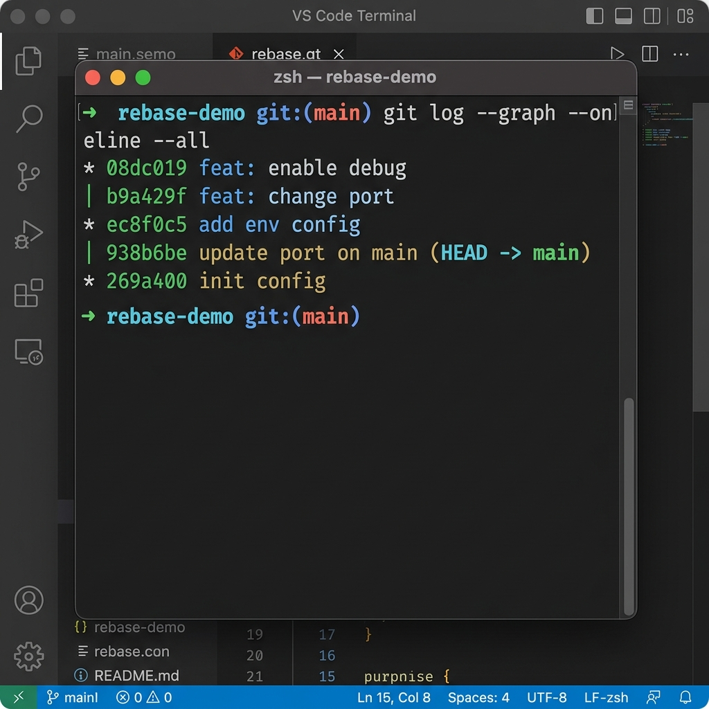

# Báo Cáo Bài 3: Xử Lý Xung Đột Phức Tạp Trong Quá Trình Rebase

## 📌 Thông Tin Bài Tập
- **Môn học**: IT209 - Quản lý phiên bản mã nguồn với Git
- **Đường dẫn bài nộp**: `homework/session_05/ex3/`
- **Mục tiêu**:
  - Hiểu sự khác biệt giữa giải quyết xung đột khi **Merge** và khi **Rebase**.
  - Thực hành quy trình giải quyết xung đột từng chặng (step-by-step conflict resolution) trong tiến trình Rebase.
  - Đưa lịch sử nhánh tính năng (`feature-api`) nối tiếp ngay sau các commit mới nhất của nhánh chính (`main`) thành một đường thẳng tắp (Linear History).

---

## 🛠️ 1. Khởi Tạo Bối Cảnh & Lịch Sử Nhánh (Setup)

### Step 1: Tạo commit ban đầu trên nhánh `main`
Khởi tạo tệp `config.json` trên nhánh `main`:
```json
{
  "port": 8080,
  "debug": false
}
```
Thực hiện commit:
```bash
git add config.json
git commit -m "init config"
```

### Step 2: Tạo nhánh `feature-api` và thực hiện 2 commit
```bash
git checkout -b feature-api
```
- **Commit 1**: Sửa `"port": 9000`
  ```bash
  git commit -am "feat: change port"
  ```
- **Commit 2**: Sửa tiếp `"debug": true`
  ```bash
  git commit -am "feat: enable debug"
  ```

### Step 3: Quay lại `main` và có thêm 2 commit mới từ thành viên khác
```bash
git checkout main
```
- **Commit 1 trên main**: Sửa `"port": 8081`
  ```bash
  git commit -am "update port on main"
  ```
- **Commit 2 trên main**: Bổ sung cấu hình môi trường `"env": "production"`
  ```bash
  git commit -am "add env config"
  ```

### 🌳 Cây Lịch Sử Git Trước Khi Rebase (`git log --graph --oneline --all`)
```text
* ec8f0c5 add env config
* 938b6be update port on main
| * b10208f feat: enable debug
| * 8d3ff7b feat: change port
|/  
* 269a400 init config
```
*Giải thích*: Nhánh `feature-api` và `main` đã bị rẽ nhánh từ commit gốc `269a400 (init config)`.

---

## ⚡ 2. Tiến Trình Rebase & Giải Quyết Xung Đột Từng Bước

Chuyển sang nhánh `feature-api` và bắt đầu Rebase lên `main`:
```bash
git checkout feature-api
git rebase main
```

---

### 🚨 Chặng 1: Conflict khi áp dụng Commit 1/2 (`feat: change port`)

#### 1. Thông báo lỗi từ Git:
```text
Rebasing (1/2)
error: could not apply 8d3ff7b... feat: change port
hint: Resolve all conflicts manually, mark them as resolved with
hint: "git add/rm <conflicted_files>", then run "git rebase --continue".
```

#### 2. Kiểm tra trạng thái (`git status`):
```text
interactive rebase in progress; onto ec8f0c5
Last command done (1 command done):
   pick 8d3ff7b # feat: change port
Next command to do (1 remaining command):
   pick b10208f # feat: enable debug

Unmerged paths:
  (use "git add <file>..." to mark resolution)
	both modified:   config.json
```

#### 3. Nội dung xung đột trong tệp `config.json`:
```json
{
<<<<<<< HEAD
  "port": 8081,
  "debug": false,
  "env": "production"
=======
  "port": 9000,
  "debug": false
>>>>>>> 8d3ff7b (feat: change port)
}
```

#### 4. Phân tích & Giải quyết:
- **Nguyên nhân**: `HEAD` (mới nhất của `main`) có giá trị `"port": 8081` và thêm `"env": "production"`. Trong khi commit `feat: change port` của `feature-api` muốn đổi `"port": 9000`.
- **Giải pháp**: Giữ lại thay đổi cổng `"port": 9000` từ `feature-api` và tích hợp cấu hình `"env": "production"` mới nhất từ `main`.

#### 5. Nội dung `config.json` sau khi sửa thủ công:
```json
{
  "port": 9000,
  "debug": false,
  "env": "production"
}
```

#### 6. Tiếp tục Rebase:
```bash
git add config.json
git rebase --continue
```

---

### 🚨 Chặng 2: Conflict khi áp dụng Commit 2/2 (`feat: enable debug`)

#### 1. Thông báo lỗi từ Git:
```text
Rebasing (2/2)
error: could not apply b10208f... feat: enable debug
hint: Resolve all conflicts manually, mark them as resolved with
hint: "git add/rm <conflicted_files>", then run "git rebase --continue".
```

#### 2. Kiểm tra trạng thái (`git status`):
```text
interactive rebase in progress; onto ec8f0c5
Last commands done (2 commands done):
   pick 8d3ff7b # feat: change port
   pick b10208f # feat: enable debug

Unmerged paths:
  (use "git add <file>..." to mark resolution)
	both modified:   config.json
```

#### 3. Nội dung xung đột trong tệp `config.json`:
```json
{
  "port": 9000,
<<<<<<< HEAD
  "debug": false,
  "env": "production"
=======
  "debug": true
>>>>>>> b10208f (feat: enable debug)
}
```

#### 4. Phân tích & Giải quyết:
- **Nguyên nhân**: Commit `feat: enable debug` gốc được tạo khi chưa có trường `"env": "production"`. Khi áp dụng đè lên commit chặng 1 (vừa bổ sung `"env": "production"`), ngữ cảnh các dòng liền kề dòng `"debug"` bị thay đổi.
- **Giải pháp**: Giữ lại `"debug": true` đồng thời bảo toàn thuộc tính `"env": "production"`.

#### 5. Nội dung `config.json` sau khi sửa thủ công:
```json
{
  "port": 9000,
  "debug": true,
  "env": "production"
}
```

#### 6. Hoàn tất Rebase:
```bash
git add config.json
git rebase --continue
```
*Kết quả*:
```text
[detached HEAD 08dc019] feat: enable debug
 1 file changed, 1 insertion(+), 1 deletion(-)
Successfully rebased and updated refs/heads/feature-api.
```

---

## 💡 3. So Sánh Giải Quyết Xung Đột: Merge vs Rebase

| Tiêu chí | Git Merge | Git Rebase |
| :--- | :--- | :--- |
| **Cơ chế xử lý** | Gộp toàn bộ thay đổi của 2 nhánh và giải quyết xung đột **1 lần duy nhất**. | Áp dụng lại từng commit một (replay), giải quyết xung đột **theo từng chặng** (step-by-step). |
| **Commit lịch sử** | Tạo thêm 1 **Merge Commit** phụ để kết nối 2 nhánh. | **Không tạo Merge Commit**, tính lại SHA hash và nối tiếp commit gốc lên đầu nhánh chính. |
| **Dạng đồ thị (Graph)** | Đồ thị phân nhánh dạng mạng nhện / rẽ nhánh và chắp lại. | Đồ thị **thẳng tắp (Linear History)**, sạch đẹp và dễ theo dõi. |
| **Mục đích sử dụng** | Bảo toàn lịch sử phát triển thực tế của các nhánh độc lập. | Làm sạch lịch sử commit trước khi hợp nhất vào nhánh chính. |

---

## ✅ 4. Kiểm Tra Kết Quả Sau Khi Hoàn Thành

### 1. Kiểm tra trạng thái working directory (`git status`)
```bash
git status
```
*Output*:
```text
On branch feature-api
nothing to commit, working tree clean
```

### 2. Nội dung tệp `config.json` cuối cùng
```json
{
  "port": 9000,
  "debug": true,
  "env": "production"
}
```

### 3. Kiểm tra lịch sử Git (`git log --graph --oneline`)
```bash
git log --graph --oneline
```
*Output*:
```text
* 08dc019 feat: enable debug
* b9a429f feat: change port
* ec8f0c5 add env config
* 938b6be update port on main
* 269a400 init config
```

### 📸 Ảnh chụp màn hình lịch sử Git thẳng tắp


---

## 🎯 Kết Luận
- Tiến trình Rebase đã diễn ra thành công qua 2 chặng xử lý xung đột thủ công mà không làm mất thông tin hay phá hỏng cấu trúc của nhánh chính `main`.
- Lịch sử Git của nhánh `feature-api` đã được làm phẳng hoàn toàn, nối tiếp trực tiếp phía sau commit mới nhất của `main`.
